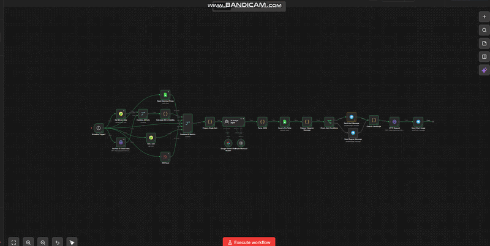

# 🚀 CryptoMind AI Pro: Advanced n8n Trading Automation

**CryptoMind AI Pro** is an autonomous cryptocurrency analysis system built on **n8n**. It orchestrates technical indicators, market sentiment, and real-time news into a single comprehensive analytical report generated by **Google Gemini AI**.

---

  <video src="https://youtu.be/cgl9QgSEO5E" width="100%" controls title="CryptoMind AI Pro Demo"></video>

## 🧠 Key Features
* **AI-Powered Analysis**: Utilizes the **Google Gemini Chat Model** to process complex market data and provide expert reasoning.
* **Technical Engine**: Custom JavaScript nodes calculate **RSI (Relative Strength Index)** and **Volatility** metrics in real-time.
* **Sentiment Tracking**: Automatically fetches the **Fear & Greed Index** to quantify market psychology.
* **Visual Intelligence**: Generates dynamic 7-day BTC price charts via **QuickChart.io** and delivers them to Telegram.
* **Smart Alerting**: Includes a high-confidence "Urgent Alert" system for oversold conditions or strong signals.
* **Data Persistence**: Automatically logs every AI decision and market metric to **Google Sheets** for long-term backtesting.

---

## 🏗 Workflow Architecture

The system is architected into four distinct functional layers:

1.  **Data Ingestion**: Pulls raw data from **CoinGecko** (Prices/Volume), **Alternative.me** (Sentiment), and **Google News RSS** (Fundamentals).
2.  **Signal Processing**: A specialized code node normalizes all metrics and calculates momentum oscillators.
3.  **AI Orchestration**: The **AI Analyst Agent** evaluates the data against a predefined expert logic matrix.
4.  **Reporting & Archiving**: Formats the final output for **Telegram** and secures the data in a **Google Pro Table**.

---

## 📊 Decision Logic Matrix

The AI follows a strict strategic framework to ensure consistency:

| Signal | Requirement Logic |
| :--- | :--- |
| **STRONG BUY** | (7d Change > 5%) AND (Fear & Greed < 50) AND (RSI < 40) |
| **BUY** | (7d Change > 3%) AND (Fear & Greed < 60) AND (RSI < 50) |
| **SELL** | (Fear & Greed > 80) OR (RSI > 70) |
| **HOLD** | Default state for all other market conditions |

---

## 🛠 Setup & Installation

### Prerequisites
* **n8n** (Self-hosted or Cloud).
* **Google Gemini API Key** (from Google AI Studio).
* **Telegram Bot** credentials (via @BotFather).
* **Google Sheets OAuth2** credentials.

### Deployment Steps
1.  Download the `CryptoMind AI pro (ENG).json` file from this repository.
2.  Import the file into your n8n dashboard.
3.  Configure the **Credentials** for Gemini, Telegram, and Google Sheets in the respective nodes.
4.  Specify your **Google Sheet ID** and **Telegram Chat ID** in the configuration.
5.  **Activate** the workflow (Default trigger: Every 10 minutes).

---

## 📋 Sample Telegram Report
> 🚀 **Bitcoin Analysis Pro**
>
> 📊 **Signal**: BUY
> 📈 **Confidence**: 0.88
> 📝 **Reasoning**: RSI is in the oversold zone (35), while fundamental news trends are turning positive. A short-term bounce is expected.
> 🐋 **Whale Alert**: No significant movements detected in the last 24h.

---

## 📄 License
Distributed under the **MIT License**.

---
### 🛒 Get Started
Unlock the full power of automated crypto intelligence today.
[**👉 Get Full Access on Gumroad**](https://naroka.gumroad.com/l/CryptoMindAIProAnalyst)
*  **Gumroad:** https://naroka.gumroad.com — check out ready-to-use workflows.
*  **linkedin:** https://www.linkedin.com/posts/david-ignatenko-3775a6408_ai-n8n-automation-ugcPost-7459649709163307009-K1sA?utm_source=share&utm_medium=member_desktop&rcm=ACoAAGgG0IsBIuo7vsmz3baGNWLF3UyD6GDEDRM

*Developed with ❤️ for the Crypto & Automation Community.*
